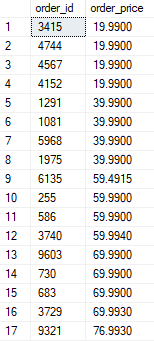
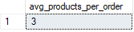
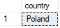

# 304. Funkcje agregujące - ćwiczenia

1. Policz wszystkich klientów.

---

2. Policz liczbę numerów telefonów z tabeli **`clients`**. Dlaczego ich liczba różni się od liczby klientów?

---

3. Policz wszystkich klientów, którzy nie mają numeru telefonu.

---

4. Wyświetl wszystkie unikalne ilości zamówionych produktów. Posegreguj wyniki od największej liczby do najmniejszej.

---

5. Dla każdego roku podaj wartość sprzedaży. Posegreguj po kolumnie **`Year`**. Weź pod uwagę cenę, ilość oraz zniżkę.

---

6. Dla każdej kategorii policz liczbę produktów kosztujących więcej niż 1500 $. Jeżeli kategoria nie posiada żadnych produktów droższych niż 1500 $, to i tak pokaż kategorię z liczbą `0`.

---
7. Pokaż produkty, które zostały zamówione mniej niż 1100 razy. Posortuj je od najmniejszej liczby zamówień do największej.

---

8. Pokaż ile kosztowało każde z poszczególnych zamówień. Wyświetl **`order_id`** oraz wartość zamówienia pod nazwą **`order_price`**. Uwzględnij cenę produktu, jego ilość oraz zniżkę (o ile jest). Posegreguj zamówienia od największej do najmniejszej wartości ceny.

---

9. Pokaż to samo co w poprzednim zadaniu, ale ogranicz wyniki do sklepów z Polski oraz **`order_price`** nie mniejsze niż 3000 $.

---

10. Pokaż dla każdej z kategorii średnią cenę produktów w tej kategorii. Wyświetl tylko te kategorię, których średnia cena produktów jest wyższa niż 1000 $.

---

11. Wyświetl pracownika, który ma najkrótsze imię. Pokaż z ilu liter się składa.

---

12. Wyświetl klienta, który wydał największą ilość pieniędzy (nie uwzględniaj zniżki).

---

13. Podaj w jednej kolumnie liczbę liter w nazwisku klientów oraz w drugiej policz ilu jest klientów, którzy taka ilość mają. Np. 13 klientów ma nazwisko składające się z 3 liter, 24 klientów ma nazwisko składające się z 4 liter, itd.

---

14. Wyświetl ile jest średnio produktów na każdym z zamówień.

---

15. Wyświetl ile w każdym roku było zamówień z poszczególnych sklepów.

---

16. Wyświetl aktywnego pracownika, który pracuje najdłużej. Pokaż ile dni pracuje do dzisiaj.

---

17. Sprawdź, ile średnio klienci zamawiają produktów i jaka jest największa kupiona ilość produktów w jednym zamówieniu.

---

18. Zwróć liczbę sprzedanych produktów oraz ich łączny zapas z tabeli `product_inventories`.

---

19. Policz średnią liczbę miesięcy przepracowanych przez tych pracowników, którzy już w firmie nie pracują.

---

20. Pokaż 5 pracowników, którzy przyjęli najwięcej zamówień.

---

21. Wyświetl kraje, w których znajduje się więcej niż jeden sklep.

---

22. Policz wszystkie towary, których cena jest niższa niż 50 $.

---

23. Pokaż ilu pracowników było zatrudnionych w każdym roku.

---

24. Wyświetl pracownika, który przyjął największą liczbę zamówień.

---

25. Wyświetl kategorię produktów i ile wynosiła dla niej łączna kwota zamówień.

---

26. Dla każdego produktu, który był kiedykolwiek zamówiony, wyświetl datę, kiedy stało się to po raz pierwszy.

---

27. Dla każdego produktu policz, ile sztuk zostało zamówionych w 2015 roku. Wyniki ogranicz tylko do tych produktów, których zamówiono łącznie mniej niż 50.

---

28. Wyświetl trzy grupy produktów, z których łącznie zamówiono największą liczbę produktów w 2015 roku.

---

29. Wyświetl liczbę zamówień oraz łączną wartość zamówień, uwzględniając dni tygodnia, w których złożono dane zamówienie.

---

30. Wyświetl 5% towarów, których łącznie sprzedano najwięcej.

---

31. Wyświetl, ile łącznie zaoszczędzili klienci z zamówień towarów, które zostały sprzedane po cenie niższej niż cena sugerowana (zamówienia po obniżce).

---

32. Wyświetl łączną wartość zamówień oraz to, jaka byłaby łączna wartość zamówień, gdyby wszystkie towary zostały sprzedane po cenie sugerowanej.

