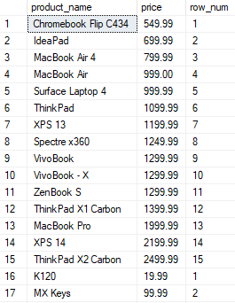
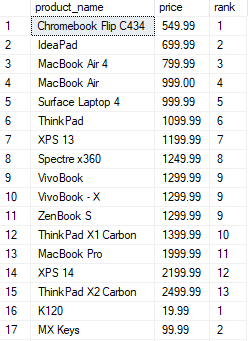
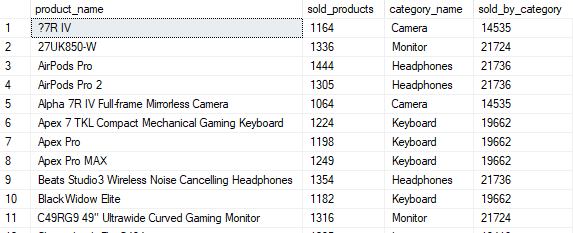
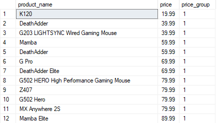
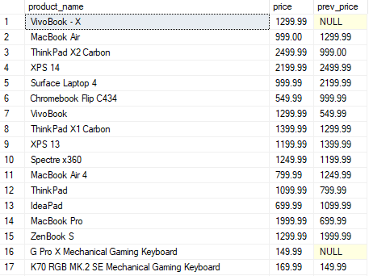
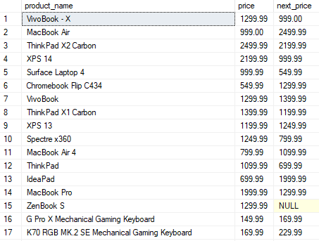
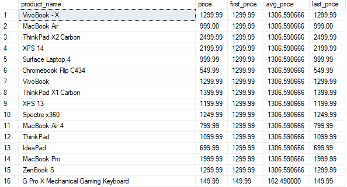
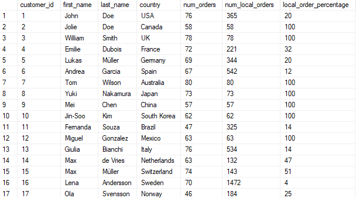

# 305. Funkcje okienkowe - ćwiczenia

```yaml
agregacyjne: AVG(), MAX(), MIN(), SUM(), COUNT()
rankingowe: ROW_NUMBERS(), RANK(), DENSE_RANK(), NTILE()
odnoszące się do rekordów: LAG(), LEAD(), FIRST_VALUE(), LAST_VALUE()
```

Funkcje okienkowe pozwalają na szerszą gamę transformacji dla danego rekordu poprzez dostęp do innych rekordów. W przypadku **`GROUP BY`**, możemy jedynie scalać rekordy w danych kolumnach i grupować je. W przypadku funkcji okienkowych różne kolumny mogą mieć różną granulacje, a same rekordy odnosić się do innych rekordów. Ostatecznie uzyskujemy oryginalny zestaw danych z dodatkową kolumną np. agregacyjną.

Najważniejszą kwestią jest zatem ustalenie do czego chcemy się właściwie odnieść, tj. do jakiego okna. Funkcje okienkowe, inaczej funkcje analityczne, zwracają wartość dla danego wiersza, pogrupowaną przez partycję.

Przykład:

```sql
SELECT
	p.product_name,
	c.category_name,
	p.price,
	AVG(p.price) OVER (PARTITION BY c.category_id) as avg_price,
	AVG(p.price) OVER () as avg_all_categories
FROM products p
JOIN categories c
	ON p.category_id = c.category_id
ORDER BY c.category_name;
```

Jak widać, w jednej tabeli mamy różne poziomy granulacji. Pokazujemy cenę dla danego produktu, ale również obok średnią cenę dla kategorii wraz z ogólną średnią. Można również użyć podzapytania, żeby uzyskać taki sam rezultat:

```sql
SELECT
	p.product_name,
	c.category_name,
	p.price,
	(SELECT AVG(p2.price) FROM products p2 WHERE p2.category_id = c.category_id) as avg_price,
	(SELECT AVG(p2.price) FROM products p2) as avg_all_categories
FROM products p
JOIN categories c
	ON p.category_id = c.category_id
ORDER BY c.category_name;
```

Jest to na pewno mniej czytelne i staje się bardzo skomplikowane przy dużej ilości funkcji okienkowych.

Samych funkcji jest bardzo dużo i w SQL Serverze są to:

**`ROW_NUMBER()`** - zwraca numer wiersza dla każdego wiersza w partycji wyniku zapytania
**`RANK()`** - zwraca rangę wiersza w partycji wyniku zapytania, przeskakując numery równe
**`DENSE_RANK()`** - zwraca rangę wiersza w partycji wyniku zapytania, bez przeskakiwania numerów równe
**`NTILE()`** - dzieli partycję wyniku zapytania na określoną liczbę równych części i przypisuje numer każdej części do wiersza
**`LAG()`** - zwraca wartość kolumny z wiersza poprzedzającego aktualny wiersz w partycji wyniku zapytania
**`LEAD()`** - zwraca wartość kolumny z wiersza następującego po aktualnym wierszu w partycji wyniku zapytania
**`FIRST_VALUE()`** - zwraca pierwszą wartość kolumny w partycji wyniku zapytania
**`LAST_VALUE()`** - zwraca ostatnią wartość kolumny w partycji wyniku zapytania
**`PERCENT_RANK()`** - zwraca rangę wiersza w partycji wyniku zapytania jako ułamek, z przedziału od 0 do 1.

W ramach ramki (window) można również sortować:

```sql
SELECT
	p.product_name,
	c.category_name,
	p.price,
	RANK() OVER (PARTITION BY c.category_id ORDER BY p.price) as price_rank
FROM products p
JOIN categories c
	ON p.category_id = c.category_id;
```

<div class="page"/>

## Praktyka

1. Wyświetl nazwę produktu, cenę i numer wiersza dla każdego produktu w kategorii, z numerem wiersza posortowanym według ceny produktu.



---

2. Wyświetl nazwę produktu, cenę i rangę produktu w kategorii, sortując po cenie produktu. W przypadku remisu, produkty powinny otrzymać tę samą rangę.



---

3. Wyświetl nazwę produktu, ile było sprzedanych tych produktów, ich kategorię oraz ilość sprzedanych produktów w każdej z kategorii.



---

4. Podziel produkty na 4 koszyki cenowe. Wyświetl nazwę produktu, cenę oraz numer koszyka (od 1 do 4). Posortuj rosnąco po cenie.



---

5. Wyświetl nazwę produktu, cenę oraz wartość, która zwróci cenę produktu z poprzedniego wiersza w ramach danej kategorii.



---

6. Wyświetl nazwę produktu, cenę oraz wartość, która zwróci cenę produktu z następnego wiersza w ramach danej kategorii.



---

7. Wyświetl nazwę produktu, cenę oraz wartość, która zwróci pierwszą cenę produktu w ramach danej kategorii oraz wartość, która zwróci ostatnią cenę w danej kategorii. Pomiędzy tymi wartościami zwróć również kolumnę która pokaże średnią cenę w danej kategorii.



---

8. Wyświetl klientów, kraj z jakiego pochodzą, ile złożyli zamówień, ile założono zamówień z kraju którego pochodzą oraz jaki procent stanowią ich zamówienia do zamówień z ich kraju.


