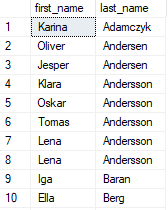
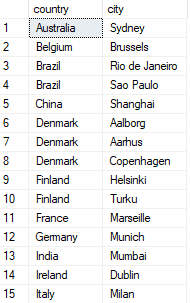
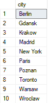
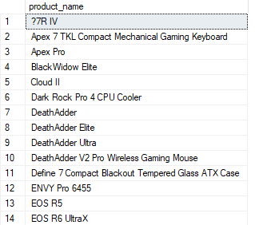
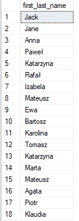
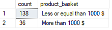
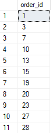

# 306. Operatory łączące zbiory - ćwiczenia

```yaml
UNION: łączy tabele i usuwa duplikaty na końcu
UNION ALL: łączy duplikaty, zostawia duplikaty
EXCEPT: zwraca tylko rekordy z pierwszego zbioru, które nie są w drugim zbiorze
INTERSECT: zwraca tylko rekordy, które są w obu zbiorach
```

**Do zapamiętania**

1. Różnica pomiędzy JOIN, a UNION:
	- JOIN łączy horyzontalnie
	- UNION łączy wertykalnie

2. Warunki dla operacji na zbiorach:
	- liczba i kolejność kolumn w obu zestawach danych musi być taka sama
	- typy danych muszą być kompatybilne
	- nazwy kolumn mogą być różne, zbiór wynikowy otrzymuje nazwę z pierwszego zapytania

3. Przypomnij sobie dodatkowo kolejność wykonywania poleceń w SQL. Zwróć szczególną uwagę na ORDER BY. Jest on po UNION, tzn. ustawiamy jeden ORDER BY w dolnym SELECT, który chcemy połączyć i służy on dla końcowego zbioru.

<div class="page"/>

## Zadania

---

1. Pokaż imiona i nazwiska wszystkich klientów oraz pracowników. Posegreguj tę listę alfabetycznie po nazwisku.



---

2. Pokaż kraj oraz miasto, z których pochodzą klienci, ale nie ma tam sklepów. Zapytanie wykonaj na dwa sposoby, jedno z użyciem operatora do zbiorów, a drugi z użyciem JOIN. Rozwiązanie posiada 59 rekordów.



---

3. Pokaż miasta z których są klienci oraz są zlokalizowane sklepy. Ponownie, użyj dwóch sposobów, aby to osiągnąć. Rozwiązanie posiada 10 rekordów.



---

4. Wyświetl produkty, których ceny są mniejsze niż 200 $ lub większe niż 3000 $. Rozwiązanie posiada 55 rekordów.



---

5. Wyświetl wszystkie występujące imiona i nazwiska pracowników w jednej kolumnie o nazwie **`first_last_name`**. Rozwiązanie posiada 64 rekordów.



---

6. Pokaż liczbę produktów, które wpadają w koszyk z ceną mniejszą lub równą 1000 $ oraz w koszyk z ceną większą niż 1000 $. Nazwij kolumny jak w rozwiązaniu poniżej.



---

7. Pokaż zamówienia, w których znajduje się produkt kupiony powyżej 9 razy (w jednym zamówieniu), ale wyklucz te, które zostały procesowane przez pracownik, który już nie pracuje. Rozwiązanie posiada 2654 rekordów.


