# 307. Podzapytania - ćwiczenia

Podzapytania pozwalają na korzystanie w zapytaniu z wyników innego zapytania. Możemy je zawrzeć w:

```yaml
SELECT: podzapytania, jako jedna z kolumn.

IN / NOT IN: sprawdź, czy wartości znajdują/nie znajdują się w zbiorze z podzapytania.

ANY / ALL: sprawdź, czy rekord jest równy/mniejszy/większy niż jakiekolwiek/wszystkie rekordy z zapytania. W porównaniu do poprzedniego, używa się tutaj =, <, >.

EXISTS / NOT EXISTS: sprawdź, czy wartości znajdują/nie znajdują się w zbiorze z podzapytania.

UPDATE / DELETE / INSERT: przeprowadź operację tylko na wybrany zbiorze.

FROM: przeprowadź kolejną operację SELECT na wyniku innego zapytania.
```

Przykład:

```sql
SELECT
    order_id,
    order_date,
    customer_id
FROM orders
WHERE customer_id IN # tutaj zaczyna się subquery
(
	SELECT customer_id
	FROM customers
	WHERE first_name = 'Ewa'
)
ORDER BY order_date DESC;
```

Przykład z SELECT:

```sql
SELECT
	order_item_id,
	order_id,
	quantity,
	(
	    SELECT MAX(price)
	    FROM products p
	    WHERE i.product_id = o.product_id
	) AS maxprice
FROM order_items o
order by quantity;
```

Powyższy przykład to **`correlated sub query`**, czyli takie podzapytanie, które używa zapytania zewnętrznego (stąd użycie klucza). Każdy rekord jest wtedy kalkulowany osobno i przekazywany do podzapytania, tym samym obniża znacząco wydajność.

Podczas zadań możesz stosować różne sposoby na uzyskanie wyniku, ale trzymaj się użycia podzapytań. Jeżeli użycie któregoś z syntax jest dla Ciebie niezrozumiałe, sprawdź je w Google.

<div class="page"/>

## Zadania

W zadaniach nie używaj **`JOIN`**, chyba że polecenie mówi inaczej.

1. Wyświetl produkty, które kosztują więcej niż średnia wszystkich produktów.

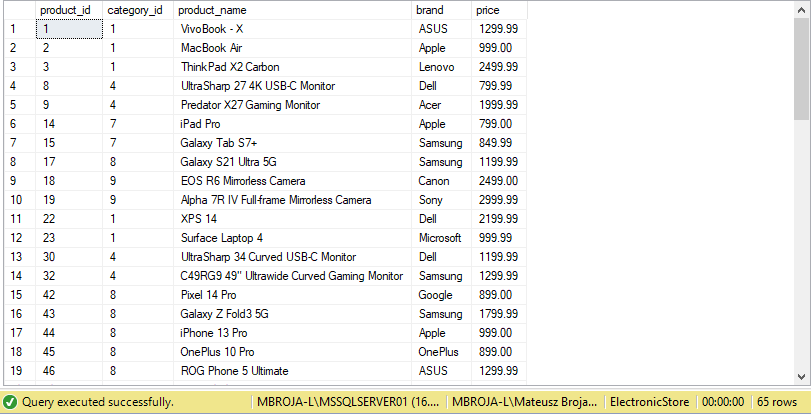

---

2. Zwróć nazwę produktu oraz jego cenę. Lista powinna zawierać tylko produkty, które posiadają cenę większą niż jakakolwiek średnia cena produktów w danym brandzie. Posegreguj wyniki po cenie, od największej do najmniejszej.

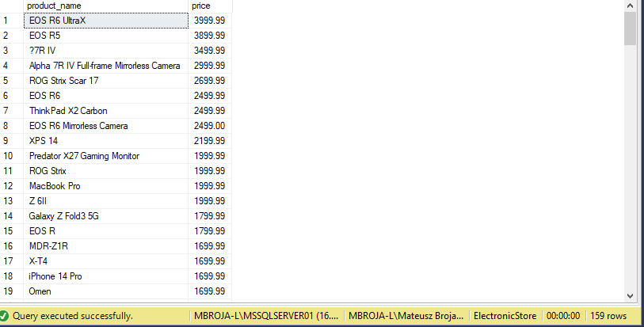

---

3. Zwróć nazwę produktu oraz jego cenę. Lista powinna zawierać tylko produkty, które posiadają cenę większą niż wszystkie średnie ceny produktów w danym brandzie. Posegreguj wyniki po cenie, od największej do najmniejszej.

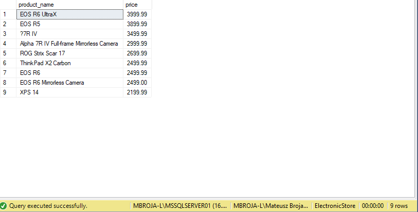

---

4. Znajdź klientów, którzy nie kupili nic w **`2013`** roku. Przedstaw dwa sposoby na utrzymanie wyniku (użyj **`IN`** oraz **`EXISTS`**).

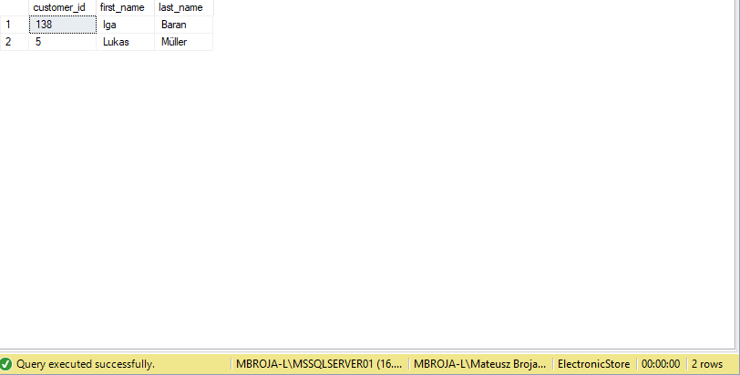

---

5. Wyświetl **`customer_id`** klientów, którzy mieszkają w tym samym mieście, co jest sklep. Masz do dyspozycji tylko jeden **`JOIN`**.

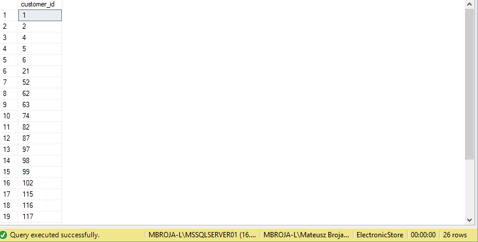

---

6. Zwróć średnią ilość zamówień jaką przyjmuje pracownik.

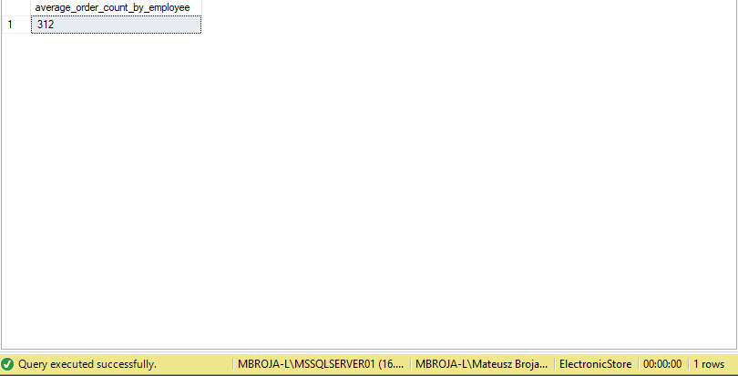

---

7. Wyświetl produkty, które były zamówione więcej niż 10 razy w jednym zamówieniu.

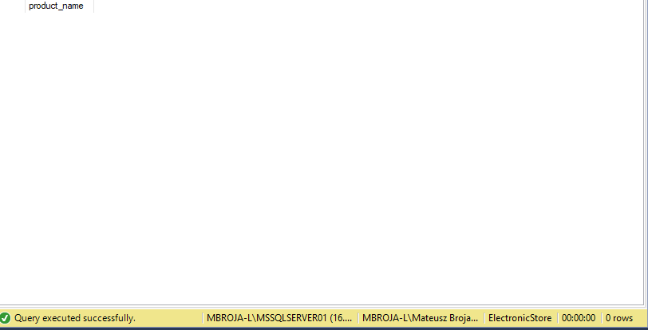

---

8. Wyświetl dane wszystkich pracowników, którzy zarabiają o minimum 30% mniej niż jest średnia wszystkich pensji w firmie.

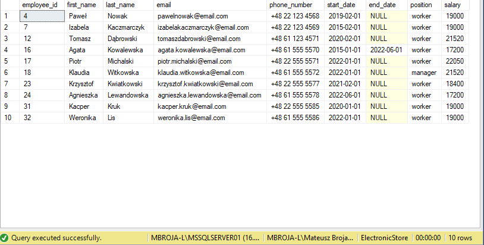

---

9. Wyświetl liczbę wszystkich pracowników oraz liczbę pracowników, którzy już nie pracują. Nie używaj **`UNION`**.

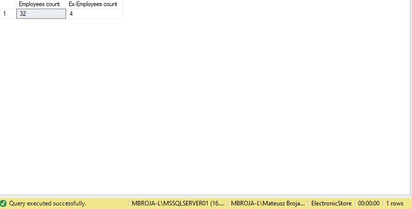

---

10. Wyświetl pracowników, którzy mają nazwiska w **`TOP 3`** najdłuższych nazwisk.

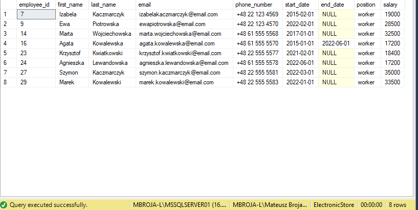

---

11. Wyświetl pracowników, ich stawkę oraz pozycję, którzy zarabiają mniej niż wynosi średnia zarobków na ich pozycji.

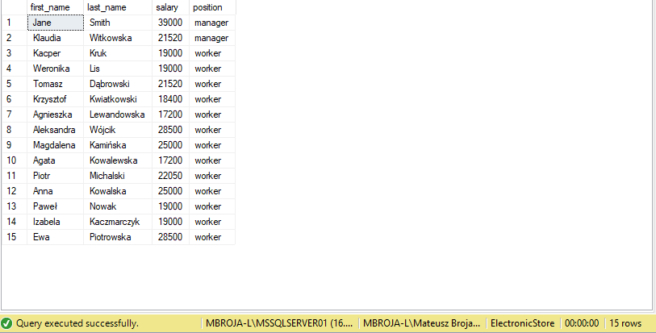

---

12. Wyświetl dane pracowników, którzy pracują najdłużej.

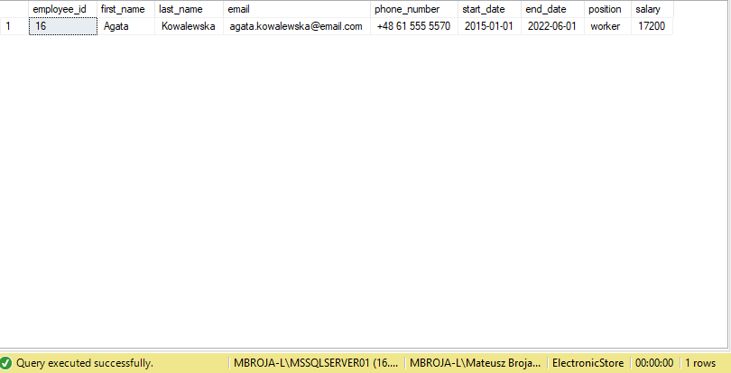

---

13. Wyświetl klientów oraz ich procentowy udział zamówień do liczby wszystkich zamówień.

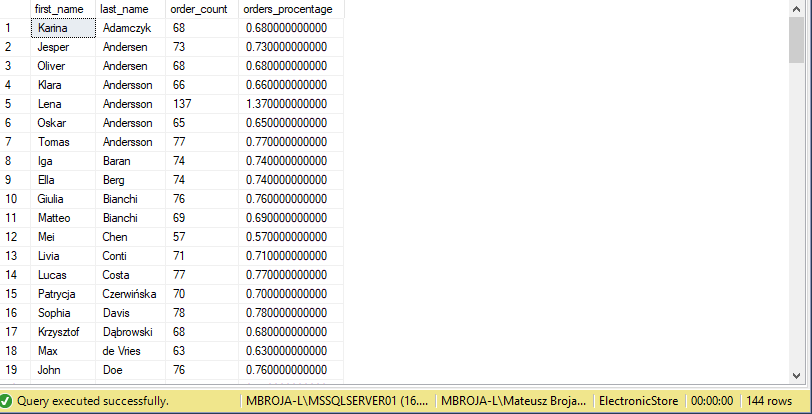

---

14. Dla każdego produktu wyświetl różnicę jego ceny do średniej ceny produktów w tej samej kategorii.

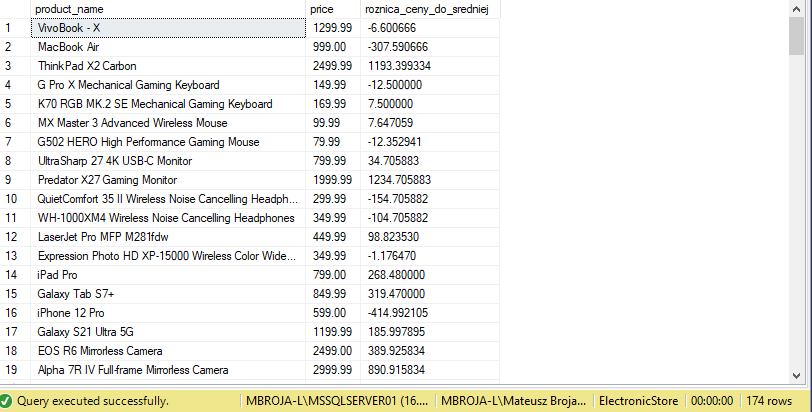

---

15. Wyświetl jaka jest maksymalna liczba wszystkich zamówionych rzeczy z jednego zamówienia.

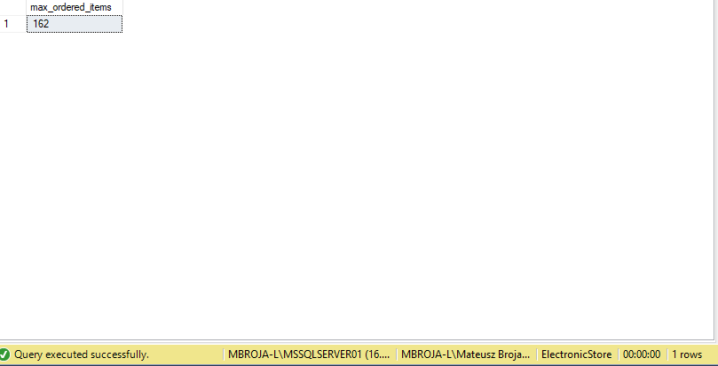

---

16. Dla każdej kategorii wyświetl kiedy po raz pierwszy został zamówiony produkt z tej kategorii. Możesz użyć trzy **`JOIN`**.

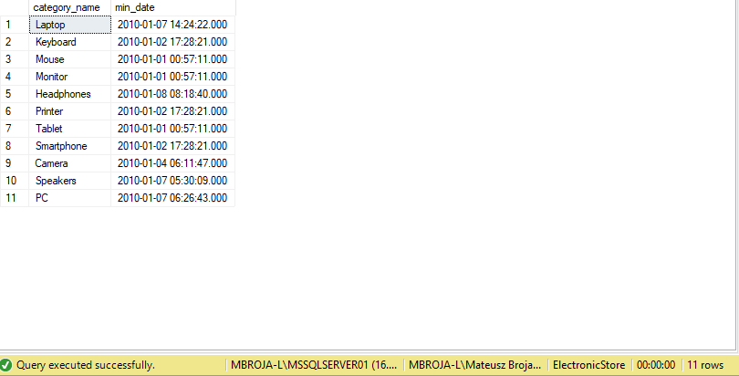

---

17. Wyświetl pracowników, których pensja jest pomiędzy najmniejszą pensją w firmie, a **28 000 $**.

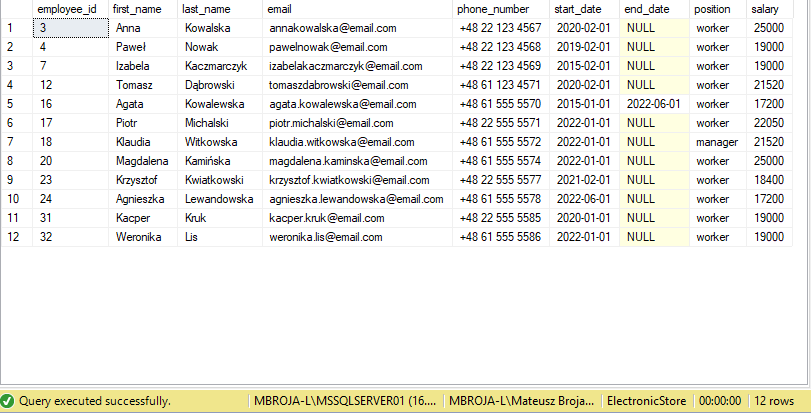

---

18. Wyświetl pracowników, którzy dostają drugą największą wypłatę w firmie.

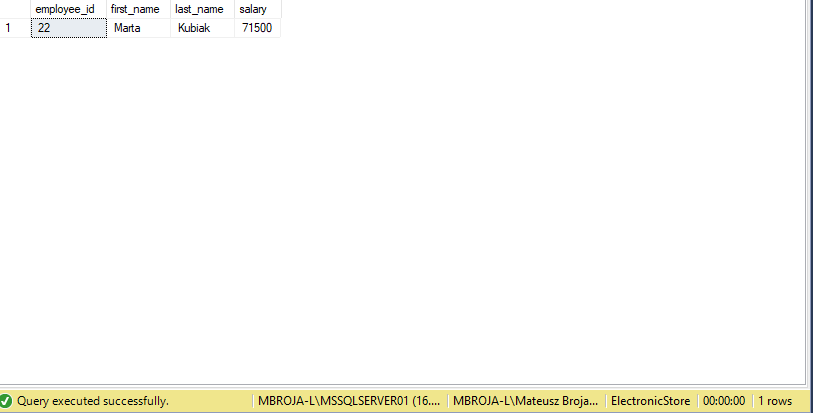

---

19. Zwróć wszystkie produkty, które są z tej samej firmy, co produkt **`GeForce RTX 3060`**.

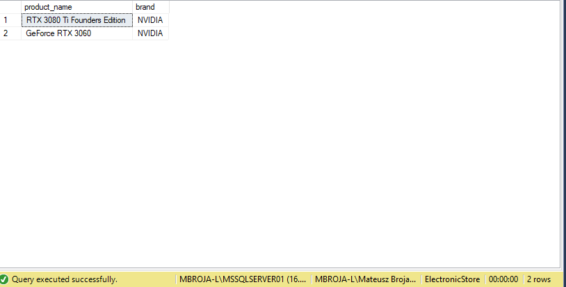

---

20. Znajdź pracowników, którzy zarabiają więcej niż najmniej zarabiający menadżer.

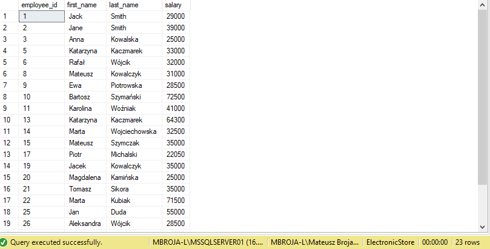

---

21. Wyświetl pracowników, których pensja jest wyższa niż średnia pensja w z każdej z pozycji.

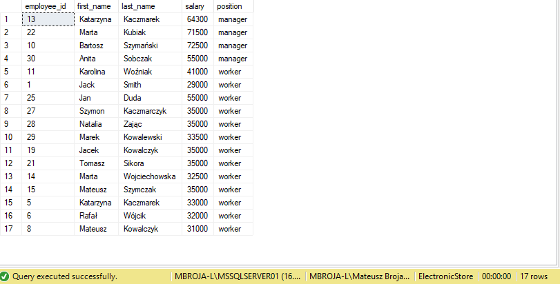

---

22. Dla każdego produktu wyświetl kategorię oraz liczbę produktów z tą samą kategorią.

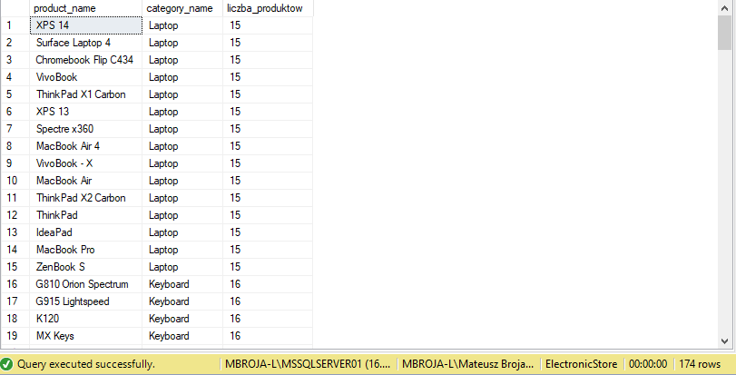
