# 308. Commmon Table Expression oraz tabele tymczasowe - ćwiczenia


**`CTE (Common Table Expression)`** oraz tabele tymczasowe to narzędzia, które pozwalają na tymczasowe przechowywanie danych i wykonywanie zapytań na tych danych. CTE to wyrażenie, które definiuje zapytanie, które może być użyte wewnątrz innych zapytań.

**`Tabele tymczasowe`** natomiast są tworzone w bazie danych na czas wykonywania zapytania, a po zakończeniu działania zapytania są usuwane automatycznie. Dzięki tym narzędziom jest łatwiej i bardziej czytelnie pisać zapytania SQL oraz unikać powielania kodu.


## CTE

Załóżmy, że mamy bazę danych z tabelą "Pracownicy", która zawiera informacje o pracownikach w firmie. Chcemy wyświetlić listę pracowników, którzy zarabiają więcej niż średnia pensja w firmie. Możemy to zrobić za pomocą CTE w następujący sposób:

```sql
WITH PracownicyFirma AS (
  SELECT * FROM Pracownicy
)
SELECT * FROM PracownicyFirma
WHERE Pensja > (SELECT AVG(Pensja) FROM PracownicyFirma)
```

W tym przykładzie tworzymy CTE o nazwie "PracownicyFirma", która zawiera wszystkie rekordy z tabeli "Pracownicy". Następnie wykonujemy zapytanie SQL, które filtruje tylko te rekordy, których pensja jest większa niż średnia pensja wśród wszystkich pracowników. Dzięki CTE kod jest bardziej czytelny i łatwiejszy do zrozumienia. Warto zauważyć, że w tym przypadku CTE nie jest konieczne i można to zrobić bezpośrednio na tabeli "Pracownicy". Jednak w przypadku bardziej skomplikowanych zapytań CTE może znacznie ułatwić pracę i zwiększyć czytelność kodu.

## Tabele tymczasowe

Tabele tymczasowe można podzielić na dwie kategorie: lokalne i globalne. Lokalne tabele tymczasowe są dostępne tylko dla sesji, w której zostały utworzone, natomiast globalne tabele tymczasowe są dostępne dla wszystkich sesji.

Poniżej przedstawiam przykład użycia tabeli tymczasowej w języku SQL Server. Załóżmy, że mamy bazę danych z tabelą "Zamówienia", która zawiera informacje o zamówieniach w sklepie internetowym. Chcemy wyświetlić sumę sprzedaży z ostatnich trzech miesięcy. Możemy to zrobić za pomocą tabeli tymczasowej w następujący sposób:

```sql
CREATE TABLE #Tymczasowa (
  Miesiąc DATETIME,
  SumaSprzedaży DECIMAL(18,2)
)

INSERT INTO #Tymczasowa
SELECT 
  DATEADD(month, DATEDIFF(month, 0, DataZamówienia), 0) AS Miesiąc,
  SUM(Cena) AS SumaSprzedaży
FROM Zamówienia
WHERE DataZamówienia >= DATEADD(month, -3, GETDATE())
GROUP BY DATEADD(month, DATEDIFF(month, 0, DataZamówienia), 0)

SELECT * FROM #Tymczasowa
```

W tym przykładzie tworzymy lokalną tabelę tymczasową o nazwie "#Tymczasowa", która zawiera dwie kolumny: "Miesiąc" i "SumaSprzedaży". Następnie wstawiamy dane do tabeli tymczasowej za pomocą zapytania SQL, które grupuje zamówienia według miesiąca i sumuje wartość zamówień z ostatnich trzech miesięcy. W końcu wyświetlamy dane z tabeli tymczasowej za pomocą zapytania SELECT.

Warto zauważyć, że lokalna tabela tymczasowa "#Tymczasowa" zostanie usunięta automatycznie po zakończeniu działania zapytania, więc nie będzie wpływać na strukturę bazy danych.

## Kiedy stosować podzapytania, CTE oraz tabele tymczasowe?

- **Subquery**:
    - Gdy potrzebujemy tylko jednej wartości zwracanej z zapytania, np. wartości maksymalnej, minimalnej, sumy, liczby rekordów.
    - Gdy zapytanie jest stosunkowo proste i nie wymaga definiowania tymczasowej tabeli.
    - Gdy zapytanie jest wykonywane tylko raz i nie jest potrzebne wielokrotne użycie.

- **CTE (Common Table Expression)**:
    - Gdy potrzebujemy wielokrotnie użyć tymczasowej tabeli w zapytaniach.
    - Gdy zapytanie jest złożone i trudne do zrozumienia, a dzięki podziałowi na mniejsze kroki kod staje się bardziej czytelny.
    - Gdy chcemy rozbić zapytanie na mniejsze, łatwiejsze do zrozumienia części.

- **Tabele tymczasowe**:
    - Gdy potrzebujemy przechować tymczasowo duże ilości danych, na których będziemy wykonywać złożone operacje.
    - Gdy zapytanie wymaga wielu operacji, które są niepraktyczne lub niemożliwe do wykonania w jednym zapytaniu.
    - Gdy potrzebujemy zapisać wyniki zapytania na dłużej, np. do dalszej analizy.

## Dodatkowe

Zapamiętaj dodatkowe dwie komendy: **`CAST`** oraz **`CASE`**. Zadania te będą wykorzystywane na teście praktycznym.

`CASE` jest to wyrażenie w języku SQL, które umożliwia warunkowe przypisywanie wartości do kolumny wynikowej. Używa się go do tworzenia niestandardowych kolumn, które zależą od warunków logicznych lub wartości innych kolumn. Składnia wyrażenia `CASE` obejmuje określenie warunków za pomocą klauzuli `WHEN`, a następnie przypisanie wartości do kolumny wynikowej za pomocą klauzuli `THEN`. Można także wykorzystać klauzulę `ELSE` do zdefiniowania wartości domyślnej dla przypadków, w których nie spełniony zostanie żaden warunek. Oto przykładowe użycie wyrażenia `CASE`:

```sql
SELECT 
    product_name, 
    price, 
    CASE 
        WHEN price > 100 THEN 'Drogi'
        WHEN price > 50 THEN 'Średni'
        ELSE 'Tani'
    END AS 'Cena'
FROM 
    products
```

W tym przykładzie wykorzystujemy wyrażenie `CASE`, aby przyporządkować każdemu produktowi wartość "Drogi", "Średni" lub "Tani", w zależności od jego ceny.

`CAST` jest to funkcja w języku SQL, która umożliwia konwersję jednego typu danych na inny. Używa się jej, gdy chcemy dokonać operacji matematycznych lub porównań między różnymi typami danych, lub gdy chcemy zwrócić wartość w określonym formacie. Składnia funkcji `CAST` obejmuje określenie wartości, która ma być przekonwertowana, a następnie określenie docelowego typu danych. Oto przykładowe użycie funkcji `CAST`:

```sql
SELECT 
    customer_name, 
    CAST(order_date AS DATE) AS 'Data zamówienia'
FROM 
    orders
```


W tym przykładzie wykorzystujemy funkcję `CAST`, aby przekonwertować datę zamówienia (która jest przechowywana jako wartość daty i godziny) na typ danych `DATE`, aby wyświetlić tylko datę bez czasu.

---
## Zadania

1.  Znajdź klientów, którzy złożyli zamówienia w ciągu ostatnich 30 dni. Użyj CTE.

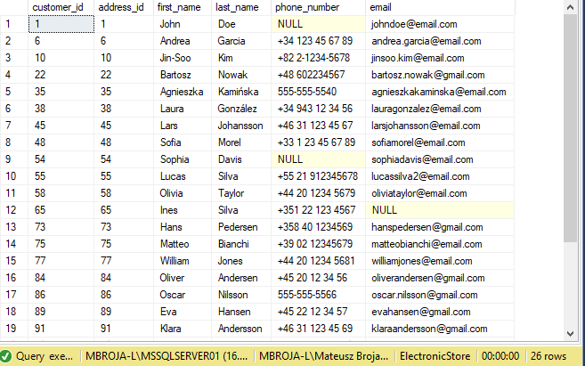

---
2.  Znajdź zamówienia, które mają status 1 (`order_status` = 1). Użyj CTE.

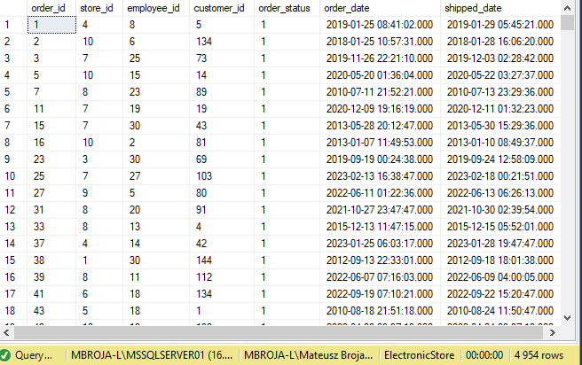

---
3.  Znajdź produkty, których cena jest mniejsza niż 50 zł. Użyj tabele tymczasowe.

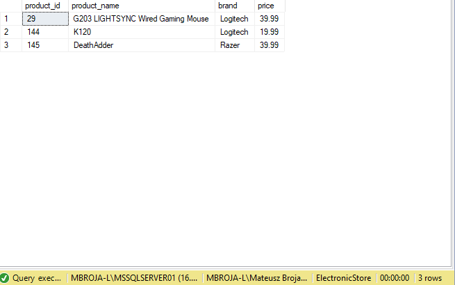

---
4.  Znajdź zamówienia złożone przez klienta o identyfikatorze 10. Użyj tabele tymczasowe.

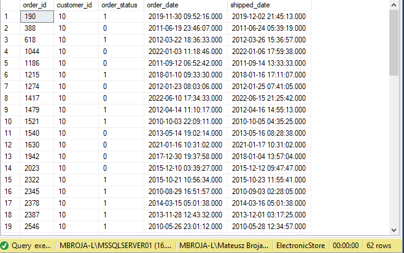

---
5. Znajdź nazwy kategorii, które mają więcej niż 5 produktów. Zwróć również liczbę produktów dla każdej kategorii.

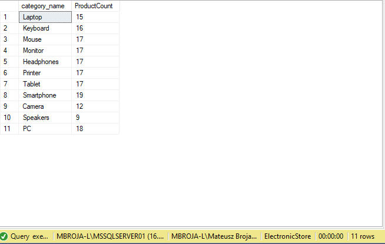

---
6. Znajdź klientów, którzy nie złożyli zamówienia w ciągu ostatnich 6 miesięcy, i przypisz im kategorię "Nieaktywni". Wynik zapisz do tabeli tymczasowej i wyświetl jej zawartość.

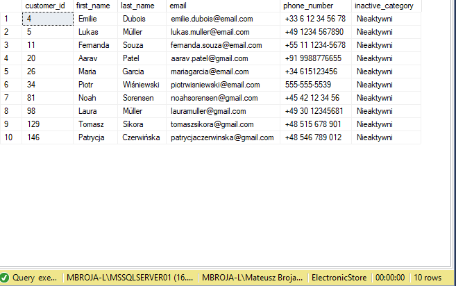

---
7. Znajdź produkty, których ilość w magazynie jest mniejsza niż 10, i przypisz im kategorię "Niski stan magazynowy". Wynik zapisz do tabeli tymczasowej i wyświetl jej zawartość.

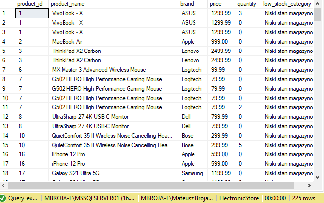

---
8. Znajdź adresy klientów, którzy zamówili produkty za więcej niż 1000 $ w ciągu ostatnich 3 miesięcy. Zwróć również liczbę zamówień i łączną wartość zamówień dla każdego adresu.

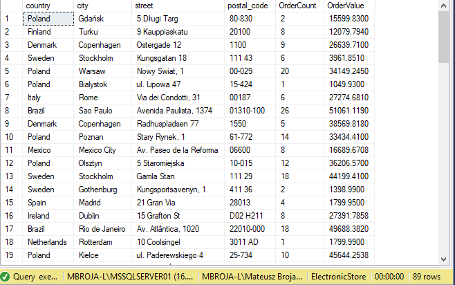

---
9. Znajdź sklepy, które nie sprzedały produktów w ciągu ostatnich 15 dni. Zwróć również datę ostatniego zamówienia dla każdego sklepu.

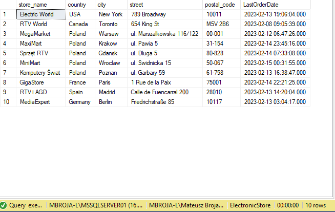

---
10. Znajdź pracowników, którzy pracują w sklepie, w którym sprzedano najwięcej produktów w ciągu ostatnich 3 miesięcy. Zwróć również liczbę sprzedanych produktów i łączną wartość sprzedaży dla każdego pracownika. Nie uwzględniaj `discount` dla uproszczenia.

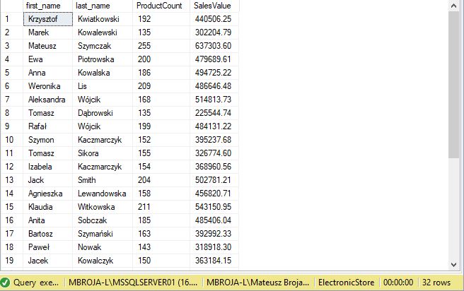

---
11. Znajdź sumę sprzedaży dla każdej kategorii produktów w ostatnim roku i zapisz wynik do tabeli tymczasowej. Następnie wyświetl kategorie produktów, których sprzedaż przekroczyła 1000000 $.

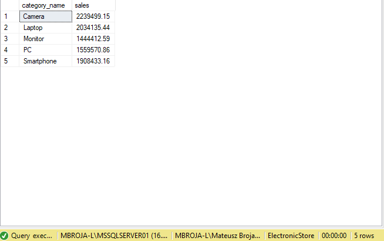

---
12. Znajdź zamówienia, które zostały złożone przez klientów mieszkających w Polsce, i przypisz im kategorię "Krajowy". Wynik zapisz do tabeli tymczasowej i wyświetl jej zawartość.

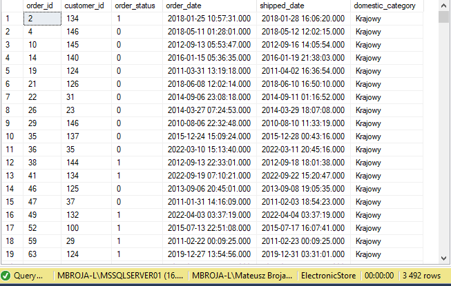
