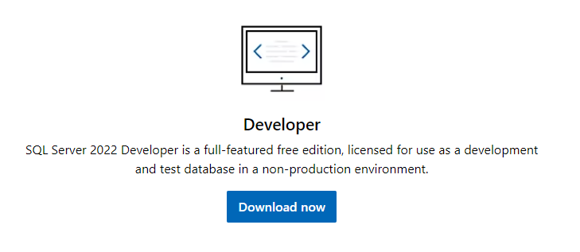
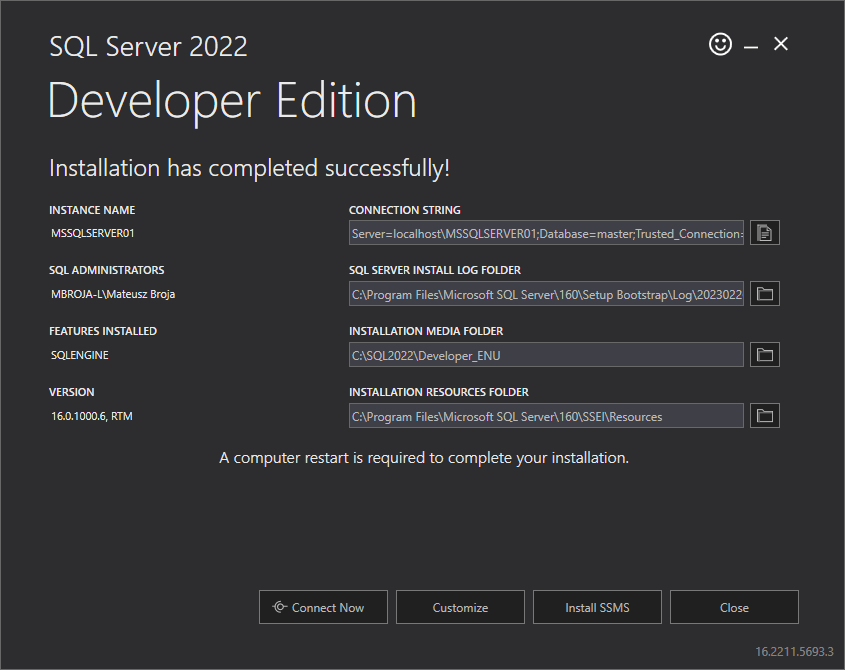
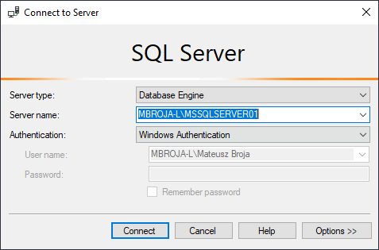
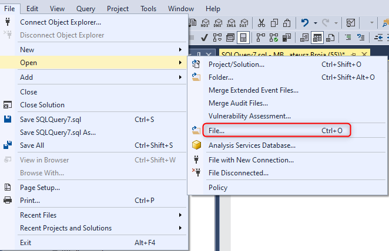
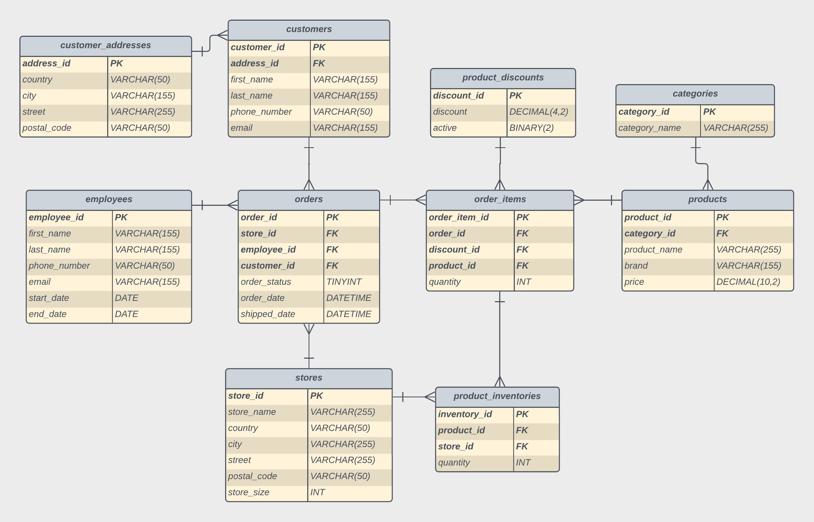
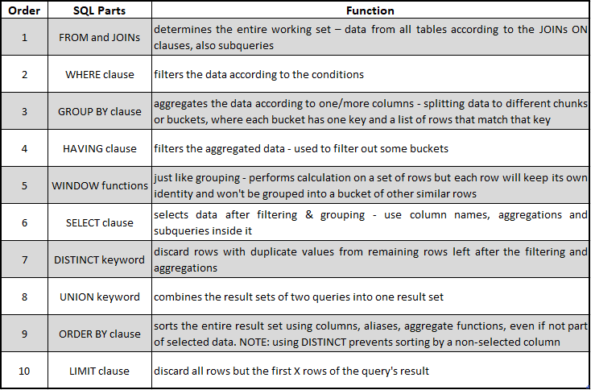

# sql-server-course

Kurs jest ściśle skoncentrowana na praktyce. Każdy z podrozdziałów zawiera szereg zadań, zaczynając od najłatwiejszych po trudniejsze. Środowiskiem jest Microsoft SQL Server.

Plan kursu składa się z 8 części praktycznych, 1 teoretycznej oraz 2 testów:

- 301: podstawowe zapytania: **`SELECT`**
- 302: funkcje wbudowane: **`DATEDIFF, YEAR, GETDATE`**
- 303: łączenie tabel: **`INNER JOIN, CROSS JOIN`**
- 304: funkcje agregujące: **`AVG, SUM`**
- 305: funkcje okienkowe: **`OVER, PARTION BY, RANK`**
- 306: operatory łączące zbiory: **`UNION, EXCEPT`**
- 307: podzapytania
- 308: CTE, tabele tymczasowe: **`#temp_table, WITH, AS`**
- 309: część teoretyczna: **`VIEW, INDEX, PROCEDURE, TRIGGER`**
- **310: test I - pytania praktyczne**
- **311: test II - pytania teoretyczne**

W dalszej części przedstawiony zostanie proces instalacji SQL Server oraz Management Studio. Jeżeli te czynności zostały już przez Ciebie wykonane to omiń ten punkt i przejdź do załadowania danych.

<div class="page"/>

## Instalacja środowiska

Środowisko, w którym będziemy pracować składa się z serwera oraz programu do jego zarządzania i wywoływania naszych poleceń. Są to, odpowiednio SQL Server oraz SQL Management Studio.

> ❗ **Do pobrania**
> [Microsoft SQL Server 2022 Developer](https://www.microsoft.com/en-us/sql-server/sql-server-downloads)
> [Microsoft SQL Server Management Studio](https://learn.microsoft.com/en-us/sql/ssms/download-sql-server-management-studio-ssms?view=sql-server-ver16)

W drugim linku kliknij na **`Free Download for SQL Server Management Studio (SSMS) 19.0.1`**. Zaczniemy zatem od środowiska do pracy. W tym celu musimy zainstalować dwa komponenty:

- bazę danych, w tym przypadku _SQL Server_
- program do zarządzania bazą danych, czyli _SQL Server Management Studio_

> ❗ **Wersje programów**
> Microsoft SQL Server 2022 Developer
> Microsoft SQL Server Management Studio version 19

<br>

**Instalacja Microsoft SQL Server 2022 Developer**

---

Wybierz wersje odpowiadającą Twojemu systemowi operacyjnemu (przykłady będą w systemie Windows 10).

Pobranie pliku nie wymaga zalogowania się do portalu. Instalacja wersji Developer jest bardzo prosta, przejdziemy punkt po punkcie:

1. Kliknij na odpowiedni przycisk pobrania oprogramowania.



2. Wybierz instalację **`BASIC`**.
3. Zaakceptuj warunki oraz przejdź do wyboru miejsca instalacji. Dla mnie jest to **`C:\software\Microsoft SQL Server`**, jednak wybierz, gdzie Ci to bardziej odpowiada lub zostaw domyślnie.

|                                                                                                  |
| :------------------------------------------------------------------------------------------------------------------------------------------: |
| _Zapamiętaj INSTANCE NAME oraz SQL ADMINISTRATORS, będzie ono potrzebne w dalszej części kursu jeżeli domyślne logowanie nie powiedzie się._ |

5. Zamknij okienko.

Masz już zatem działający lokalny serwer na swoim komputerze. Domyślnie będzie się on włączał i działał w tle przy uruchomieniu Twojego komputera. Teraz potrzebujemy nim zarządzać.

<br>

**Ustawienie SQL Server Management**

---

Pobranie Management Studio przebiega w sposób domyślny, podobnie jak zainstalowanie serwera.

Jeżeli uda Ci się już przejść przez te etapy to otwórz zainstalowany Management Studio. Żeby odpowiednio zarządzać wcześniej stworzoną instancją, trzeba podłączyć się pod nią poprzez właśnie ten program.

W okienku wybierz domyślną nazwę serwera oraz logowani przy pomocy Windows Authorizer:



Jeżeli instalacja serwera przebiegła pomyślnie to powinieneś mieć już dostęp do instancji, gdzie teraz będzie tworzyć swoją bazę danych.

<br>

**Utworzenie bazy danych**

---

Naciśnij prawy przyciskiem myszy na nazwie instancji (serwera) i wybierz **`Create database`**.

W okienku wpisz i utwórz bazę:

```
database name: ElectronicStore
```

Teraz musimy utworzyć tabele oraz załadować do nich dane. Zrobimy to przy pomocy poleceń **`CREATE TABEL`** oraz **`INSERT/VALUE`**. Są to polecenia DDL oraz DML. W folderze **`code`** znajdują się 3 skrypty, które będzie potrzebował do załadowania danych:

```
ElectronicStore_create.sql - tworzy schemat bazy danych, wraz z relacjami
ElectronicStore_drop.sql - usuwa wszystkie struktury danych
ElectronicStore_insert.sql - ładuje dane do tabel
```

Po utworzeniu bazy danych wybierz w wierszu na samej górze **`File`**, a później **`Open`** i znowu **`File`**.



Wybierz najpierw pierwszy z plików **`ElectronicStore_create.sql`** oraz kliknij **`Execute`** po pojawieniu się poleceń w Management Studio. Zrób to samo dla **`ElectronicStore_insert.sql`**.

Tym sposobem masz już bazę danych, schemat oraz dane w SQL Serverze. Dla pewności uruchom poleceni:

```sql
SELECT *
FROM orders
JOIN order_items
ON orders.order_id=order_items.order_id;
```

Jeżeli w prawym dolnym rogu widzisz liczbę **60 925** to znaczy, że wszystkie kroki uruchomiłeś poprawnie. Jeżeli tak nie jest, uruchom skrypt **`ElectronicStore_drop.sql`** i uruchom go dwukrotnie, po czym powtórz ładowanie danych od początku.

<div class="page"/>

## Baza danych ElectronicStore

Baza danych, która właśnie załadowaliśmy na nasz serwer nazywa się ElectronicStore i zawiera dane sklepu ze sprzętem elektronicznym, wraz z klientami, zamówieniami, sklepami, pracownikami i wiele więcej. Dokładny schemat wygląda tak:



Postaraj się zapoznać z jej strukturą, będzie Ci łatwiej składać zapytania wraz ze znajomością samych danych. Sam proces poznawania schematu i co zawiera jest również sporą częścią pracy inżynierów danych oraz analityków. Zapisz to zdjęcie i korzystaj z niego podczas pisania zapytań. Możesz również wejść do pliku **`ElectronicStore_create.sql`** i przeanalizować dokładniej strukturę tabel. Zwróć uwagę na typy danych, np. użycie **`DECIMAL`** zamiast **`FLOAT`** dla price (wszelkie dane składujemy w **`DECIMAL`**, ponieważ nie chcemy zaokrągleń, które proponuje **`DOUBLE`** czy **`FLOAT`**).

Po instalacji serwera, uruchomia swojej bazy danych, załadowania danych oraz zapoznania się ze schematem, możemy zacząć pierwszą właściwą część kursu z podstawowymi zapytaniami **`SELECT`**.

Polecam również przypomnieć sobie kolejność wykonywania poszczególnych operacji przez silnik bazy danych. Pomoże Ci to znacząco w rozwiązywaniu bardziej skomplikowanych zadań.

Poniżej tabelka, którą zachęcam nauczyć się na pamięć.



Powodzenia!
